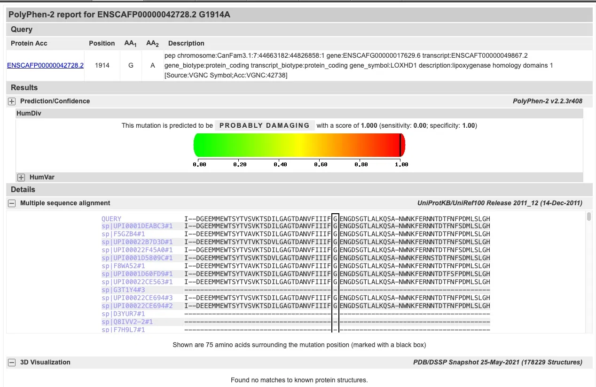

# Rottweiler LOXHD1 Variant Calling Pipeline

**Reproduces:** Hytonen et al. *Human Genetics* 2021\
**DOI:** [10.1007/s00439-021-02286-z](https://doi.org/10.1007/s00439-021-02286-z)\
**Study:** Missense variant in LOXHD1 associated with canine nonsyndromic hearing loss in Rottweilers

------------------------------------------------------------------------

## Final Result

The pipeline successfully reproduces the pathogenic variant reported in the paper

## Filtering Results

| Filter | Variants remaining |
|---|---:|
| All variants | ~millions |
| PASS + missense + homozygous `(1/1)` | 3,956 |
| + SIFT deleterious | 578 |
| + SIFT score = 0 + minimum 10 reads support | 41 |
| **Target variant: LOXHD1 p.G1914A** | **Present in the final filtered set** |

------------------------------------------------------------------------

Without the paper’s private cohort of control genomes for population-level filtering, **41 candidate variants remain**. The **LOXHD1 p.G1914A** variant is present within this final set and has strong supporting evidence.

Additional validation using Polyphen-2 gave a score of 1.000, classified as probably damaging. 

------------------------------------------------------------------------

| Field              | Value                        |
|--------------------|------------------------------|
| Gene               | LOXHD1                       |
| Position (canFam3) | chr7:44,806,821              |
| Change             | G\>C                         |
| Protein change     | p.G1914A (Glycine → Alanine) |
| Genotype           | 1/1 (homozygous)             |
| FILTER             | PASS                         |
| SIFT score         | 0.0 (maximally deleterious)  |
| PolyPhen-2 score   | 1.000 (probably damaging)    |

The variant emerged naturally by implementing the pipeline.

------------------------------------------------------------------------

## Data

| Sample         | Accession   | Type         | Platform    |
|----------------|-------------|--------------|-------------|
| Rottweiler WES | SRR13743383 | Exome        | NextSeq 500 |
| Rottweiler WGS | SRR13743384 | Whole genome | HiSeq X Ten |

BioProject: [PRJNA702911](https://www.ncbi.nlm.nih.gov/bioproject/PRJNA702911)

Reference genome: canFam3 (CanFam3.1), Ensembl release 104

------------------------------------------------------------------------

## Pipeline Overview

The pipeline follows two parallel branches (WES and WGS) that merge at joint genotyping.

```         
Raw FASTQs (WES + WGS)
    ↓
FastQC → MultiQC (raw QC)
    ↓
Trimmomatic (adapter trimming)
    ↓
FastQC → MultiQC (post-trim QC)
    ↓
WES branch                    WGS branch
BWA mem                       BWA mem + SAMBLASTER
GATK MarkDuplicates         
    ↓                             ↓
GATK BQSR (BaseRecalibrator + ApplyBQSR)
    ↓
GATK HaplotypeCaller
    ↓
GATK CombineGVCFs + GenotypeGVCFs (joint genotyping)
    ↓
GATK Hard Filters (SNPs + Indels separately)
    ↓
Remove chr prefix (for VEP compatibility)
    ↓
Ensembl VEP (annotation + SIFT)
    ↓
Candidate variant filtering
```

------------------------------------------------------------------------

## Filters applied

| Filter | Reason |
|---|---|
| PASS | Variants that pass the hard filters based on GATK documentation; removes low-quality variant calls. |
| missense_variant | Only variants that change the amino acid sequence of a protein. |
| Homozygous | Implements the paper’s autosomal recessive inheritance hypothesis. |
| SIFT deleterious | SIFT predicts whether an amino acid change affects protein function based on evolutionary conservation. A deleterious prediction corresponds to a score ≤ 0.05. A score of 0 means the position is perfectly conserved across species and changing it is predicted to be maximally damaging. |
| Min 10 reads support | Ensures the variant call is well-supported by sequencing data. Low-depth variants are filtered out. |

------------------------------------------------------------------------

### Software used

- Snakemake 9.2.0
- conda
- All other tools installed via conda envs

### Reference Files

| File                          | Source                          |
|-------------------------------|---------------------------------|
| canFam3.clean.fa              | Ensembl release 104             |
| canis_lupus_familiaris.vcf.gz | EVA RS release 6 (CanFam3.1)    |
| VEP cache                     | Ensembl release 104 (CanFam3.1) |
